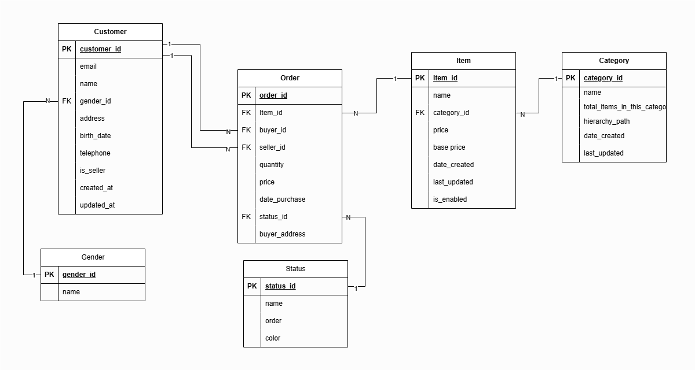

# Documentação do Modelo de Dados

## Descrição Geral

Este documento descreve o modelo de dados para um sistema de e-commerce, abrangendo as tabelas principais e suas relações. O modelo foi projetado para atender às necessidades de negócio, como o gerenciamento de clientes, itens, categorias e ordens de compra.

## Modelo Entidade-Relacionamento (DER)

Abaixo está o diagrama do modelo entidade-relacionamento que ilustra as tabelas e os relacionamentos do sistema:

## Tabelas do Banco de Dados

### 1. Tabela `Gender`
Tabela responsável por armazenar os gêneros disponíveis para os clientes.

#### Estrutura:
- `gender_id`: Identificador único do gênero (PK).
- `name`: Nome do gênero (ex.: Masculino, Feminino, Outro).

### 2. Tabela `Customer`
Tabela responsável por armazenar os dados dos clientes (compradores e vendedores).

#### Estrutura:
- `customer_id`: Identificador único do cliente (PK).
- `name`: Nome do cliente.
- `gender_id`: Referência ao gênero do cliente (`Gender.gender_id` - FK).
- `address`: Endereço do cliente.
- `birth_date`: Data de nascimento.
- `telephone`: Telefone de contato.
- `is_seller`: Indica se o cliente é um vendedor.
- `created_at`: Data de criação do registro.
- `updated_at`: Data de última atualização.

### 3. Tabela `Category`
Tabela que armazena as categorias dos itens no marketplace.

#### Estrutura:
- `category_id`: Identificador único da categoria (PK).
- `name`: Nome da categoria.
- `total_items_in_this_category`: Total de itens pertencentes à categoria.
- `hierarchy_path`: Caminho da categoria (hierarquia).
- `date_created`: Data de criação da categoria.
- `last_updated`: Data de última atualização.

### 4. Tabela `Item`
Tabela que armazena os produtos disponíveis no marketplace.

#### Estrutura:
- `item_id`: Identificador único do item (PK).
- `name`: Nome do item.
- `category_id`: Referência à categoria (`Category.category_id` - FK).
- `price`: Preço do item.
- `base_price`: Preço base do item.
- `date_created`: Data de criação do item.
- `last_updated`: Data de última atualização do item.
- `is_enabled`: Indica se o item está ativo.

### 5. Tabela `Status`
Tabela que armazena os status disponíveis para as ordens.

#### Estrutura:
- `status_id`: Identificador único do status (PK).
- `name`: Nome do status (ex.: Pending, Completed, Canceled).
- `order`: Ordem de prioridade do status.
- `color`: Cor representando o status.

### 6. Tabela `Order`
Tabela que representa as transações realizadas no marketplace.

#### Estrutura:
- `order_id`: Identificador único da ordem (PK).
- `item_id`: Referência ao item comprado (`Item.item_id` - FK).
- `buyer_id`: Referência ao comprador (`Customer.customer_id` - FK).
- `seller_id`: Referência ao vendedor (`Customer.customer_id` - FK).
- `quantity`: Quantidade comprada.
- `price`: Valor total da ordem.
- `date_purchase`: Data da compra.
- `status_id`: Referência ao status da ordem (`Status.status_id` - FK).
- `buyer_address`: Endereço do comprador.

### 7. Tabela `Daily_Item_State`
Tabela que armazena o estado diário dos itens (preço e ativação).

#### Estrutura:
- `item_id`: Referência ao item (`Item.item_id` - FK).
- `price`: Preço do item no final do dia.
- `is_enabled`: Indica se o item está ativo no final do dia.
- `snapshot_date`: Data do registro.